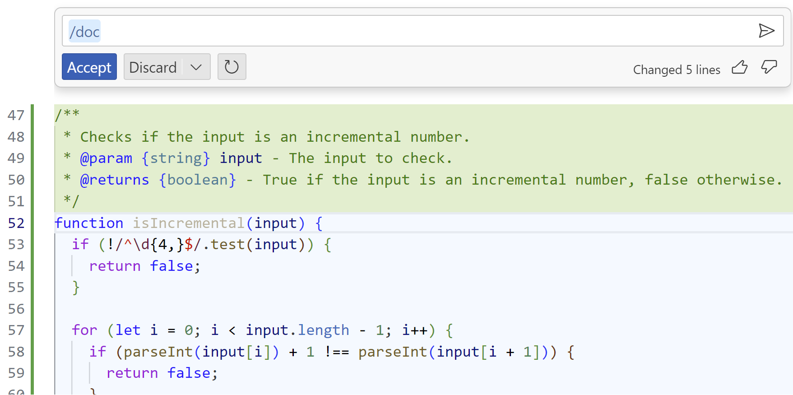

## Workshop exercises

### Core exercise

The following exercises will help you get started with GitHub Copilot. You must have completed the [setup instructions](<./1. setup.md>) before starting these steps.


### Step by step instructions

<details>
<summary>1. Getting the application running</summary>

1. Press ```CTRL + ` ``` to open the terminal window in VS Code if it is not already open.

2. Enter ```npm install``` in the terminal window and press **ENTER** to install the required dependencies. Ignore any issues displayed after you run this command.

    Let's start by running the application to learn what it does.

3. Enter ```npm start``` in the terminal window and press **ENTER** to run the application.

4. In the pop-up window that appears in the bottom right corner of the Codespace window, click the **Open in Browser** button. This will securely map port 3000 from the Codespace environment to your local browser so you can see the running calculator application.

    

5. Do some simple calculations to show that the calculator is working as expected.

    

6. Close the browser window for now and return to the Codespace window.

7. Ensure your focus is in the terminal window and press ``` CTRL + C ``` to stop the application.

</details>

<details>
<summary>2. Adding features using GitHub Copilot</summary>

### Adding the buttons to the calculator UI

1. Open the ```public/index.html``` file in the editor window.

2. Open Copilot Chat and type "Tell me about the code in this file".

    >**TIP:** You can ask Copilot Chat to summarise the contents of the file, ask follow questions, and ask questions about the development framework. 

3. Scroll down to where you see the ```<!-- TODO: Buttons -->``` comment

4. Let us try to understand how the addition operation is performed from the existing code. Select the line ```<button class="btn" onClick="operationPressed('+')">+</button>```, right click, select '**Copilot**', and '**Explain This**'. Review the explanation in the Copilot Chat window.
    

5. Add a new line below the TODO comment and type the following two lines. Start with the first line and press enter. You should see GitHub Copilot start to autocomplete the second line. When you see this, just press ```TAB``` to accept the completion.

    ``` <!-- add a button for a power (or exponential) function --> ```

    ``` <button class="btn" onClick="operationPressed('^')">^</button> ```

    Your finished snippet should match the following.

    

### Adding the logic for the new features

6. Open the ```api/controller.js``` file in the editor window.

7. Scroll down to where you see the ```// TODO: Add operator``` comment

8. Press **ENTER** at the end of the line that defines the divide function.

9. Start typing the following line and notice that GitHub Copilot should start to offer code completion half way through the word "power" as you're typing. Press **TAB** to accept the suggestion.

    ```'power':    function(a, b) { return Math.pow(a, b) },```

10. Open the ```public/client.js``` file in the editor window.

11. Scroll down to where you see the ```// TODO: Add operator``` comment (Line 22)

12. Move your cursor to the end of the line 35 (to the right of ```break;``` and press **ENTER**.

    GitHub Copilot should display ghost text suggesting the code shown in the following screenshot. Press **TAB** to accept the suggestion.

    

13. Press **ENTER** at the end of the line, then accept the next two lines Copilot suggests.

    Your completed addition should match the following.

    

14. Press ```CTRL + ` ``` to open the terminal window in VS Code.

15. Enter ```npm start``` in the terminal window and press **ENTER** to run the application.

16. You should test the new button by clicking 3, then the "^" (power) button, then click 2. Click "=" and the result should be 9.

17. Close the browser window, return to the Terminal window in Codespaces and press ```CTRL+C``` to terminate the application.

    **Success**, you have enhanced the calculator application using GitHub Copilot!

    >**Note**: GitHub Copilot is probabilistic so you may not get the exact same code suggestions as we did. If you're not happy with the suggestions, you can always press **CTRL + Z** to undo the changes and try again.

</details>

<details>
<summary>3. Exploring features</summary>

1. Scroll down to end of ```api/controller.js``` file 

2. Press ```CTRL+I``` to open the inline Copilot assistant.

3. Type the below line and press **ENTER**. 

    ```create a function that checks if the input matches an incremental format of digits with a minimum of 4 digits```

    GitHub Copilot should display text suggesting the code shown in the following screenshot. Accept the suggestion.

    


4. Select all the lines of the function ```isIncremental``` and press ```CTRL+I``` to open the inline Copilot assistant. Type ```/``` and select ```doc```.

    GitHub Copilot should display text suggesting the documentation shown in the following screenshot. Accept the suggestion.

     

5. Let us test this function using Copilot Chat. Select the function ```isIncremental```, open Copilot chat and try ```What does this function do to input 12345?```.

6. Now try with ```What does this function do to input 123467?```

    >**TIP**: You can use Copilot chat to test and verify your functions, giving you an efficient way to review the code. We will learn about writing test cases in the next section.  
   
</details>

#### What's next?

You're now ready to start the [challenge exercises](<./3. challenge exercises.md>) to see how you can leverage the power of GitHub Copilot to solve a number of challenges yourself.
